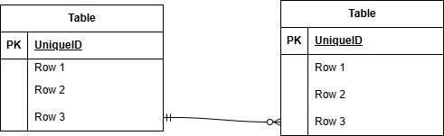

# COACHTECH フリマ

## 環境構築

### Dockerビルド

- `git clone <リポジトリのURL>`
- `docker-compose up -d --build`

### Laravel環境構築

- `docker-compose exec php bash`
- `composer install`
- `cp .env.example .env`
- `php artisan key:generate`
- `php artisan migrate`
- `php artisan db:seed`
- `php artisan storage:link`
- `exit`

## 開発環境

- 会員登録画面：http://localhost/register
- ログイン画面：http://localhost/login
- 商品一覧画面：http://localhost/
- phpMyAdmin：http://localhost:8080/

## 使用技術（実行環境）

- PHP 8.x
- Laravel 8.x / 10.x（※旦那の実際のバージョンに合わせてください）
- MySQL 8.0.x
- nginx 1.21.1
- Docker / docker-compose

## ER図

